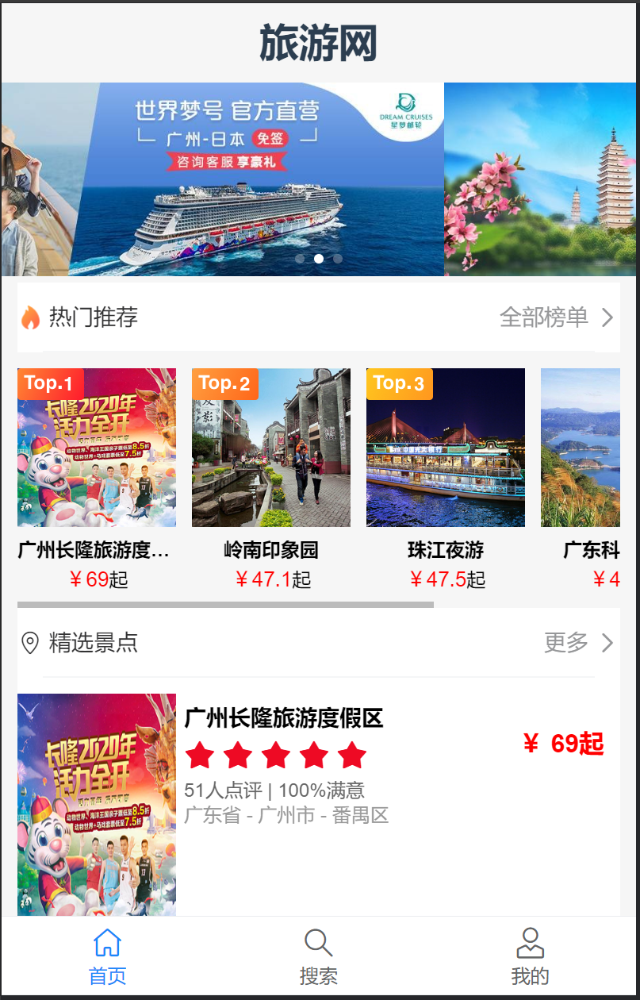
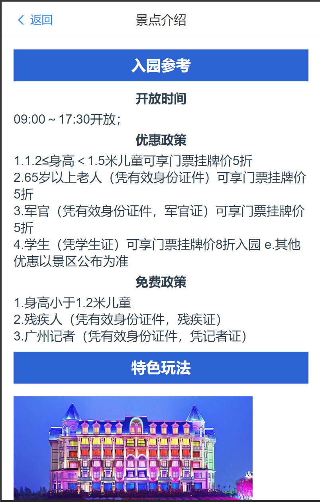
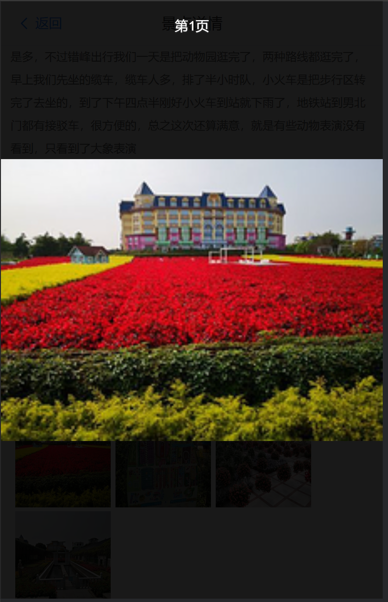

# 旅游网站开发
## 结果展示
### 1.首页界面

<!--  -->

### 2.搜索页面（所有景点）

<!--  -->

### 3.按分类查看景点（热门/精选）

<!-- 
 -->

### 4.景点详情

<!-- 
 -->

### 5.景点评论及图片预览

<!-- 
 -->

### 6.用户登录及注册

<!--  -->

### 7.个人中心

<!-- 
 -->

### 8.门票下单

<!-- 
 -->

### 1.1、前端组件开发
- 轮播图组件开发：
  1. 查找Vant中可以使用的组件
  2. 实现组件爱你模版部分
  3. 模型层准备数据
  4. 模拟数据，实现轮播效果
- 热门推荐组件开发：
  1. 查找Vant中可以使用的组件
  2. 完成布局，实现组件模版部分
  3. 模型层准备数据
  4. 添加数据，实现效果
- 精选景点组件开发：
  1. 查找Vant中可使用的组件
  2. 完成布局，实现组件模版部分
  3. 模型层准备数据
  4. 添加数据，实现效果
- 景点列表组件开发：
  1. 分析组件的复用情况
  2. 新建组件文件，实现组件内容
  3. 设置props从父组件传递数据
- 页面底部组件开发：
  1. 查找Vant中可使用的组件
  2. 完成布局，实现组件模版部分
  3. 模型层准备数据
  4. 模拟不同的菜单进入效果
### 1.2后台接口开发
- 模型设计：
  1. 系统模块：轮播图、用户反馈
  2. 景点模块：景点、景点详情、景点评论
  3. 用户模块：用户、用户详细信息、登录历史
  4. 订单模块：订单、订单明细、支付相关
- 轮播图ORM模型：
  1. 分析并设计数据库模型
  2. 完成ORM模型编码
  3. 检测ORM模型
  4. 模型同步
     * 设计接口返回标准
       1) 定义接口的返回结构
       2) 接口的错误信息约定
      编写接口代码
     * 模拟HTTP请求，测试验证接口
- 景点ORM模型：
  1. 分析并设计模型
  2. 完成ORM模型编码
  3. 检测ORM模型
  4. 模型同步
     * 设计接口返回内容及字段
     * 编写接口代码（查数据、分页）
     * 模拟HTTP请求，测试验证接口
### 1.3、接口联调：
  1. 阅读接口文档
  2. 配置接口地址
  3. 使用axios获取数据
  4. 将数据设置到模型层

### 2.1、前端组件开发：
- 景点搜索页面：
      查找Vant中可以使用的组件
      实现组件模版部分
      模型层准备数据
      模拟数据，实现效果
- 搭建前端详情页：景点大图、门票列表、评论列表
      设计URL路由规则
      新建详情页页面
      修改景点列表组件，支持路由跳转
      拆分详情页组件
### 2.2后台API接口开发
- ORM模型设计：
  * 分析并设计模型
  * 完成ORM模型编码
  * 检测ORM模型
  * 模型同步
- 重构响应对象：
  * 设计响应单个对象的基类
  * 设计响应列表对象的基类
  * 设计错误基类
- 景点详情接口：
  * 设计接口，返回内容及字段
  * 编写接口代码
  * 模拟HTTP请求，测试验证接口
### 2.3、接口联调：
  - 修改景点列表，支持搜索
  - 配置接口地址
  - 使用axios获取数据
  - 将数据设置到模型层

### 2.4、优化
- 页面优化
  * 添加loading动画
  * 添加请求拦截
  * 修改页面标题：在public/index.js文件中，title标签中设置的是网页的显示标题
  * 添加滚动加载和下拉刷新
- Redis高速缓存：
  * Redis实现验证码存储
  * Vuex保存用户信息
  * Django用户模型
  * 统一的错误拦截及异常处理

### 3.1、用户登录与注册
- 准备登录的Django模版、表单
- 设计用户模型
- 实现用户的同步登录
  * 认证用户：user=authenticate(username='john', password='secret')
  * 判断认证后的用户是否为None：用户不为None则表示用户认证通过
  * 调用login函数登录用户：login(request, user, backend=None)
- 添加登录拦截
- 实现退出登录功能
  * 使用logout函数退出当前登录的用户
### 3.2、用户接口开发
- 用户登录、退出接口：
  * 设计接口返回内容及字段
  * 编写接口代码
  * 模拟HTTP请求，测试验证接口
- 用户详细信息、验证码发送接口：
  * 设计接口返回内容及字段
  * 编写接口代码
  * 模拟HTTP请求，测试验证接口
- 用户注册接口：
  * 设计接口返回内容及字段
  * 编写接口代码
  * 模拟HTTP请求，测试验证接口
### 3.3、用户接口联调
- 用户登录接口联调：
  * 在登录组件调用登录接口
  * 设置用户信息到Vuex
  * 在个人中心显示用户信息
  * 刷新时调用个人信息接口
- 发送验证码、用户注册接口联调：
  * 阅读接口文档
  * 配置接口地址
  * 使用axios获取数据
  * 将数据设置到模型层

### 4.1、订单接口开发：
- 门票下单、订单详情接口：
  * 设计接口返回内容及字段
  * 编写接口代码
  * 模拟HTTP请求，测试验证接口
- 门票支付、取消、删除接口：
  * 设计接口返回内容及字段
  * 编写接口代码
  * 模拟HTTP请求，测试验证接口
- 我的订单列表、门票详细信息接口：
  * 设计接口返回内容及字段
  * 编写接口代码
  * 模拟HTTP请求，测试验证接口
### 4.2、订单接口联调：
- 门票下单支付：
  * 完成页面间的跳转
  * 配置接口地址及请求参数
  * 处理数据返回
- 门票详细信息、门票支付：
  * 阅读接口文档
  * 配置接口地址
  * 使用axios获取数据
  * 将数据设置到模型层
- 我的订单列表：
  * 完成页面间的跳转
  * 配置接口地址及请求参数
  * 处理数据返回
  * 路由切换后的数据处理
- 取消订单：
  * 完成页面间的跳转
  * 配置接口地址及请求参数
  * 处理数据返回
- 删除订单：
  * 阅读接口文档
  * 配置接口地址
  * 使用axios获取数据
  * 将数据设置到模型层

